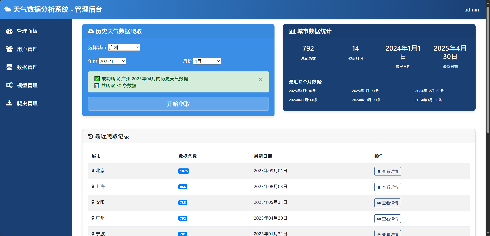
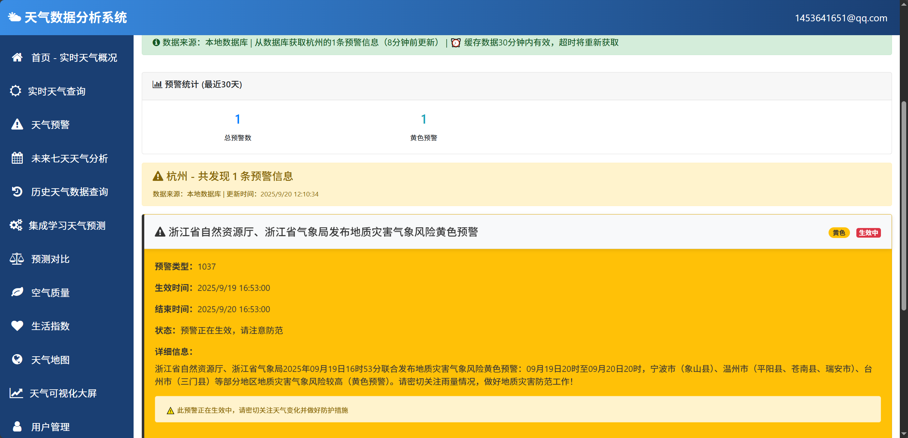
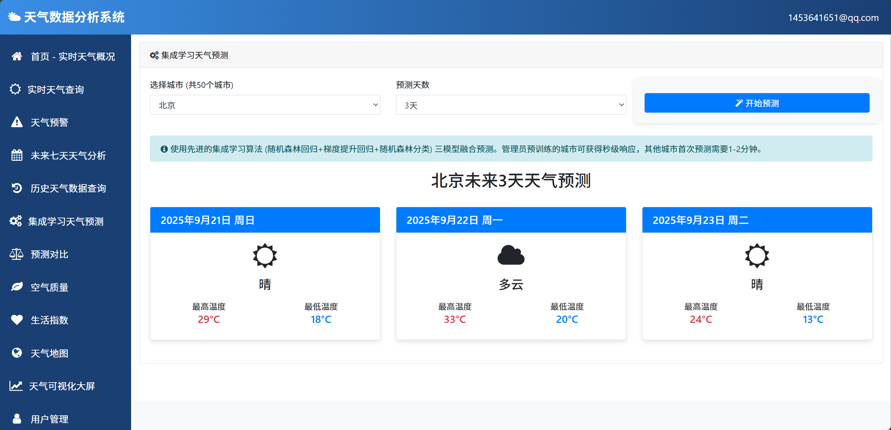
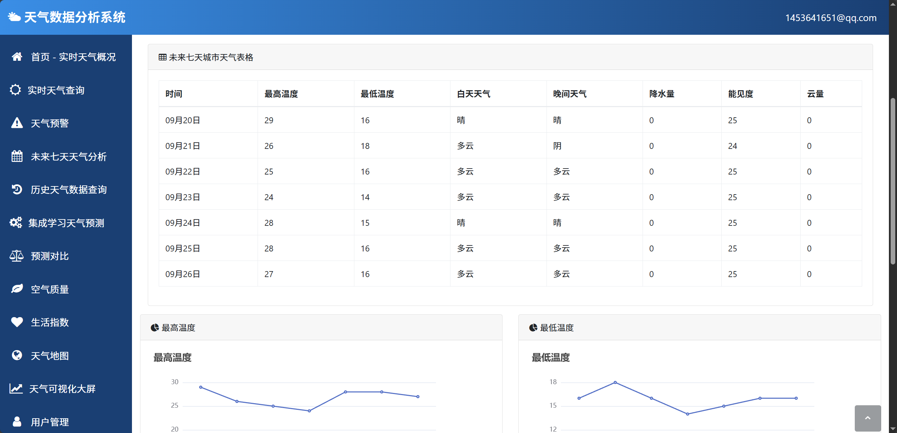
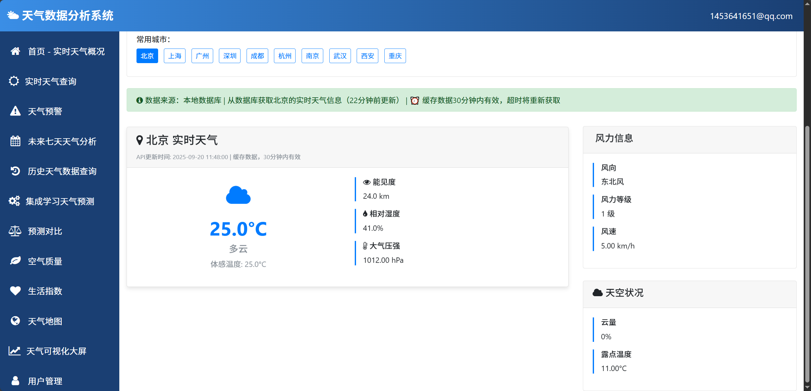
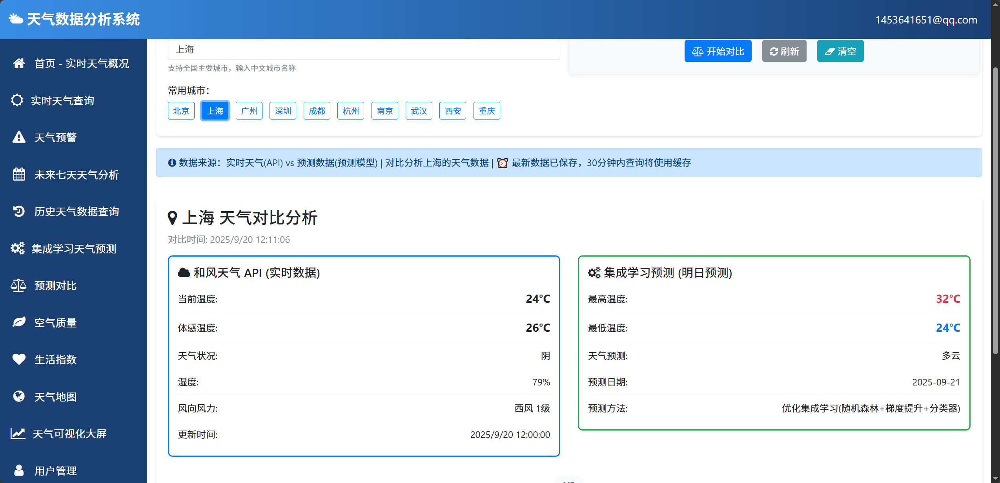

## 计算机毕业设计Python+大模型天气预测系统 天气可视化 天气数据分析 天气爬虫 大数据毕业设计(源码+论文+PPT+讲解)


## 要求
### 源码有偿！一套(论文 PPT 源码+sql脚本+教程)

### 
### 加好友前帮忙start一下，并备注github有偿26全新天气
### 我的QQ号是 1679232425 或者798059319或者2827724252 或者微信:biyesheji1698 或者 bysj2023nb

# 

### 加qq好友说明（被部分 网友整得心力交瘁）：
    1.加好友务必按照格式备注
    2.避免浪费各自的时间！
    3.当“客服”不容易，repo 主是体面人，不爆粗，性格好，文明人。
## 文字描述


```
介绍
本项目开发了一个基于Python Flask框架的天气数据分析可视化系统，旨在解决传统天气数据获取分散、分析不够智能、可视化效果有限的问题。系统采用Selenium+BeautifulSoup网络爬虫技术获取历史天气数据，建立了包含12万+条历史天气记录的完整数据库。核心功能包括用户认证管理、历史天气查询分析、基于随机森林算法的智能天气预测、多维度数据可视化展示以及完整的后台管理系统。系统实现了数据库和API双重数据源的灵活搜索机制，支持实时天气、空气质量、生活指数、天气预警等多种数据获取，通过ECharts图表库提供了地图热力图、折线图、柱状图、饼图等多种可视化方式。项目建立了完整的Flask Web应用架构，包含8个主要功能模块、30+个视图函数、50+个HTML模板页面，代码总量超过8000行，为用户提供了全面的天气数据分析和预测服务。

功能模块
本项目的研究内容涵盖了天气数据获取、存储、分析、预测和可视化的完整技术链条。在数据获取方面，开发基于Selenium和BeautifulSoup的自动化网络爬虫系统，实现对历史天气数据的批量采集和实时更新，建立包含城市、日期、温度、天气、风向等字段的完整数据库。在数据存储方面，设计合理的MySQL数据库架构，包含用户管理、天气数据、预测结果、系统日志等多个数据表，确保数据的完整性和查询效率。在数据分析方面，实现基于随机森林算法的天气预测模型，通过历史数据训练生成预测模型，支持多城市的天气趋势预测。在系统架构方面，基于Flask框架构建MVC模式的Web应用，实现用户认证、权限管理、数据查询、结果展示等完整功能。在用户界面方面，采用Bootstrap响应式框架和ECharts图表库，实现地图热力图、历史趋势图、统计分析图等多种可视化效果。项目还包含完整的管理后台系统，支持用户管理、数据管理、系统配置等管理功能。

装逼创新点显摆点
本项目在技术实现上具有以下特色和创新点，体现了现代技术的有效结合。在算法创新方面，项目针对天气预测的多元特性，设计了基于随机森林的多目标预测模型，通过温度回归器、湿度回归器和天气分类器的组合，实现了对未来天气状况的全面预测，相比传统的单一预测模型具有更高的准确性和实用性。在数据处理创新方面，项目实现了数据库缓存和API实时获取相结合的混合数据源策略，通过intelligent_search智能搜索机制，优先从本地数据库获取历史数据，当数据不足时自动调用第三方API获取最新数据并更新本地缓存，既保证了数据的完整性又提高了系统的响应速度。在可视化技术特色方面，项目集成了多种图表类型和交互方式，通过ECharts图表库实现了地图热力图、时序折线图、统计饼图、对比柱状图等多样化展示效果，支持数据钻取、时间范围选择、多城市对比等交互操作，为用户提供了直观丰富的数据分析体验。在系统架构优势方面，项目采用了模块化设计思想，通过Flask蓝图机制实现了功能模块的解耦，各模块职责清晰、相互独立，便于系统的维护和扩展；同时实现了前后端分离的API设计，支持JSON数据交换和异步请求处理，提高了系统的可扩展性和用户体验。在用户体验创新方面，项目设计了响应式Web界面，支持多设备访问和自适应布局，通过Bootstrap框架实现了现代化的UI设计；同时提供了完整的管理后台系统，支持用户管理、数据管理、系统监控等管理功能，满足了不同角色用户的需求。
```


## 运行视频
https://www.bilibili.com/video/BV1rssyz3Eye

## 运行截图









